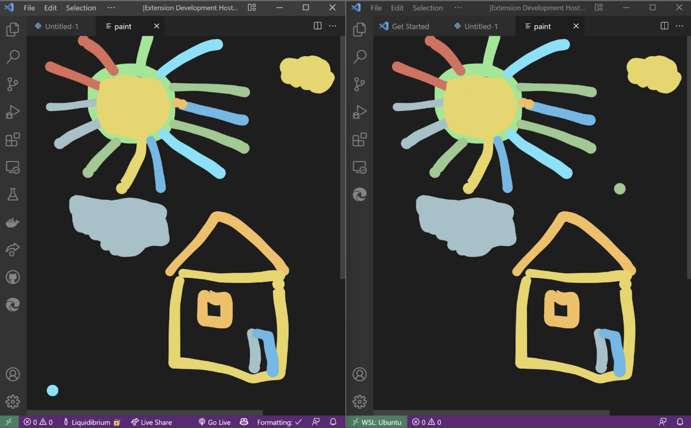

# draw-code README

This is WebRTC and Yjs based peer-to-peer VSCode Paint extension   

```CTRL + SHIFT + P```

select comand 'Peer Draw'



**Enjoy!**

### TODO

1. Make Individual rooms
2. Add undo option
3. track user names on board


Inspiration - <https://replit.com/@dmonad/Awesome-Drawing-App>
